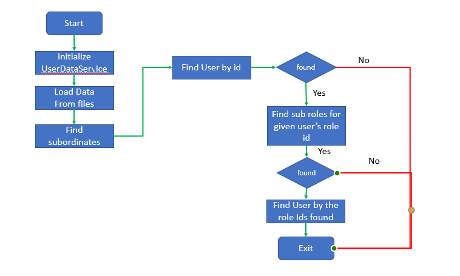

The Solution loads user and role data and provide functionality to find subordinates for a given user.

# Assumption 
Data volume fits in memory and does not effect performance while sequential lookup.


# Solution
* On application startup, it loads user and role data and keep it in memory in array structure. Data are kept in JSON format in files.
* Sequential search is performed while looking for a particular user or role in respective array.
* To find subordinates of a user, the application does as follows,
      * Find the role ID for the user
      * find all the roles below 
            (First time it builds the list of sub roles and keep the list in memory to be used for further request for same role.)
      * find users with the list of sub roles 




# How to run
Gradle is required to build the solution. It is assumed gradle is available. Run the following gradle command
```
gradlew clean build
```
it will build an executable jar at /build/libs folder. Run the jar as follows,
```
java -jar deputy-test-1.0-SNAPSHOT.jar